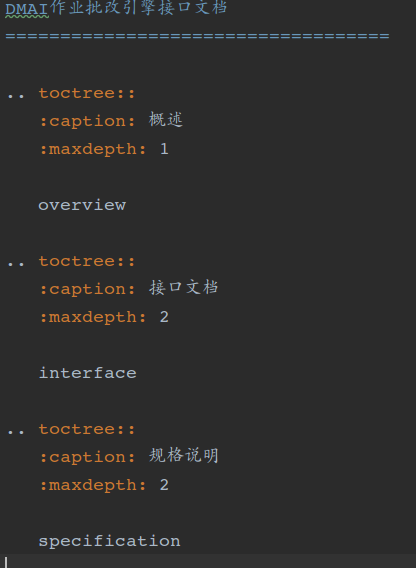
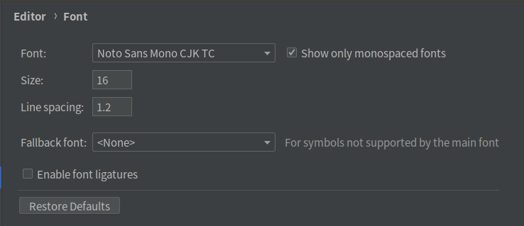
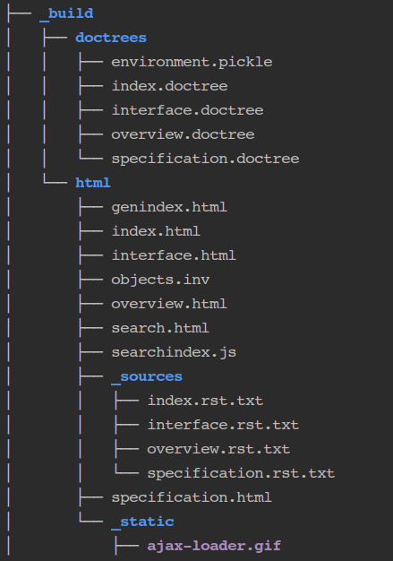

# sphinx+gitlab+readthedocs文档托管步骤

## 1.安装sphinx
- 在ubuntu本地环境安装sphinx: 
        
      sudo apt install python3-sphinx
  
- 在python虚拟环境安装: 
      
      pip install sphinx 或: conda install sphinx

## 2.sphinx使用方法

- 在文件目录执行: 

      sphinx-quickstart

- 执行后需要对配置做选择, 可以全部默认, 后续可以在生成的conf.py做修改
- 执行后生成一份主页文档index.rst, 可以通过index.rst对其他文件做索引, 组合成一个文档比如

  
- 生成文档格式:

  
- 含中文的表格文档编写可以用pycharm的等宽字体, 方便表格对齐

  
- rst标记语言编写参考: https://3vshej.cn/rstSyntax/index.html
- 也可以在原有项目基础上直接修改文档信息，主要修改的文件：`specification.rst`,`overview.rst`,`index.rst`,`conf.py`和`interface.rst`

## 3.生成文档
- 在Makefile目录下执行: 
  
      make html 或者 bash build

- 执行后生成的目录结构如图: 

- 直接点击index.html就可以在浏览器看到文档

## 4.readthedocs文档托管
- 上面sphinx生成的文档需要通过点击index.html才可以看到文档, 而且只能在本地看, 去到其他终端就需要把文件拷贝一份才能看。 
- 可以通过文档托管解决这个问题.
- 托管步骤

      1.把源码上传到github或者gitlab, 不需要上传make html生成的文件, 网站会自动构建, 注意项目要是公开项目
      2.在https://readthedocs.org/ 导入github或者gitlab上的项目就可以通过一个url查看到文档了